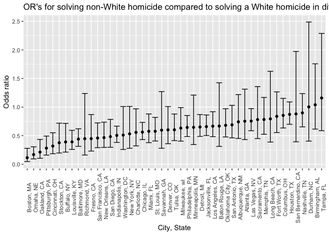
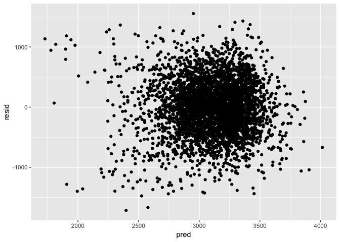
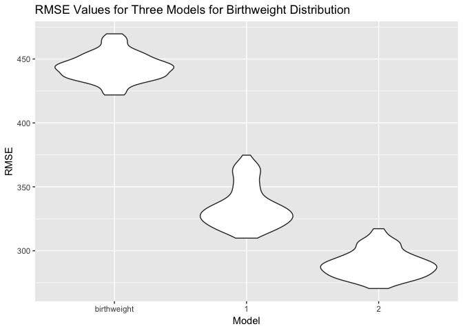

Homework6
================
Chirag Shah
2018-11-27

``` r
library(tidyverse)
library(rvest)
library(purrr)
library(modelr)
library(patchwork)
```

Problem 1
---------

``` r
homicides = read_csv("https://raw.githubusercontent.com/washingtonpost/data-homicides/master/homicide-data.csv")
```

    ## Parsed with column specification:
    ## cols(
    ##   uid = col_character(),
    ##   reported_date = col_integer(),
    ##   victim_last = col_character(),
    ##   victim_first = col_character(),
    ##   victim_race = col_character(),
    ##   victim_age = col_character(),
    ##   victim_sex = col_character(),
    ##   city = col_character(),
    ##   state = col_character(),
    ##   lat = col_double(),
    ##   lon = col_double(),
    ##   disposition = col_character()
    ## )

``` r
##reading in data from github 
```

The dataset contains 52179 reports on homicides and 12 variables. The homicide information contained in this dataset shows us the data for homicides in 50 US cities for a decade.

``` r
homicides = homicides %>% 
  unite("city_state", c("city", "state"), sep = ", ", remove = TRUE) %>% 
##creating city_state variable by uniting the city and state 
  mutate(solved = as.numeric(disposition == "Closed by arrest"), 
         victim_race = ifelse(victim_race != "White", "non-White", "White"),  
         victim_race = fct_relevel(victim_race, "White", "non-White"),
         victim_age = as.numeric(victim_age)) %>% 
##creating binary variable for whether the case was solved or not
##changing victim_race so that it is either non-White or White and ensuring White is the reference group
##making victim_age a numeric variable
  filter(!(city_state %in% c("Dallas, TX", "Phoenix, AZ", "Kansas City, MO", "Tulsa, AL")))
```

    ## Warning in evalq(as.numeric(victim_age), <environment>): NAs introduced by
    ## coercion

``` r
##filtering out unwanted observations
```

Logit Modeling
--------------

``` r
baltimore_model = homicides %>% 
##running glm only on Baltimore
  filter(city_state == "Baltimore, MD") %>% 
  glm(solved ~ victim_sex + victim_race + victim_age, family = binomial, data = .)
  ##created model for Baltimore

broom::tidy(baltimore_model) %>% 
  ##tidying data
  mutate(odds_ratio = exp(estimate), 
         lower_bound = exp(estimate - 1.96*std.error), 
         upper_bound = exp(estimate + 1.96*std.error)) %>% 
  ##defining odds ratio, and upper and lower bounds of the confidence interval
  filter(term == "victim_racenon-White") %>% 
  ##selecting relevant parameter
  select(odds_ratio, lower_bound, upper_bound) %>% 
  knitr::kable(digits = 3)
```

|  odds\_ratio|  lower\_bound|  upper\_bound|
|------------:|-------------:|-------------:|
|        0.441|         0.313|          0.62|

In Baltimore, among non-white victims, the odds of having a solved homicide is 0.441 times the odds of having a solved homicide among white victims, adjusting for sex and age. We are 95% confident that the true odds ratio lies between 0.313 and 0.620.

``` r
city_model = homicides %>% 
  group_by(city_state) %>% 
  ##group by city_state because we want each distinct city to have a model
  nest() %>% 
    mutate(logit_solved = map(data, ~glm(solved ~ victim_sex + victim_race + victim_age, 
                                      family = binomial, data = .x)), 
         logit_solved = map(logit_solved, broom::tidy)) %>% 
  select(-data) %>% 
  unnest() %>% 
  ##using nest and unnest to map the model for all distinct cities in the dataset
  mutate(odds_ratio = exp(estimate), 
         lower_bound = exp(estimate - 1.96*std.error), 
         upper_bound = exp(estimate + 1.96*std.error))
  ##defining odds ratio and upper and lower bounds for the 95% confidence interval
```

``` r
city_model %>% 
  filter(term == "victim_racenon-White") %>% 
  ##selecting the parameter we want
  select(odds_ratio, lower_bound, upper_bound, city_state) %>% 
  mutate(city_state = forcats::fct_reorder(city_state, odds_ratio)) %>% 
  ##ordering by city_state
  ggplot(aes(x = city_state, y = odds_ratio)) + 
  geom_point() + 
  geom_errorbar(aes(ymin = lower_bound, ymax = upper_bound)) + 
  ##adding error bars to each odds ratio to show the 95% confidence interval for the odds ratio
  labs(title = "OR's for solving non-White homicide compared to solving a White homicide in different cities", 
       y = "Odds ratio", 
       x = "City, State") +
  theme(axis.text.x = element_text(angle = 90))
```



The above plot shows the estimated ORs and CIs for each city. Tampa, FL seems to have the highest odds ratio comparing the resolved homicide cases among non-whites vs whites. Boston, MA seems to have the lowest odds ratio comparing the resolved homicide cases among non-whites vs whites

Problem 2
---------

``` r
birthweight = read_csv("data/birthweight.csv") %>% 
  janitor::clean_names()
```

    ## Parsed with column specification:
    ## cols(
    ##   .default = col_integer(),
    ##   gaweeks = col_double(),
    ##   ppbmi = col_double(),
    ##   smoken = col_double()
    ## )

    ## See spec(...) for full column specifications.

``` r
##checking for missing data
missing_values = sum(is.na(birthweight))
##sum is 0, therefore there is no missing data in this dataset
birthweight = birthweight %>% 
  mutate(babysex = as.factor(babysex), 
         frace = as.factor(frace), 
         malform = as.factor(malform), 
         mrace = as.factor(mrace))
## changing variables to factors
```

``` r
linear_model_birthweight = 
  birthweight %>% 
  lm(bwt ~ gaweeks + momage + wtgain + fincome + malform + mrace, data = .)
  ##creating model using variables that I found interesting
```

My hypothesis for this model is that there are maternal socioeconomic and biologic factors that can influence infant birthweight. This model is testing the association between mother's gestational weeks and birthweight of the offspring at delivery adjusting for mother's age, weight gain, family income, presence of malformations, and mother's race.

``` r
birthweight %>% 
  modelr::add_residuals(linear_model_birthweight) %>% 
  modelr::add_predictions(linear_model_birthweight) %>% 
  ggplot(aes(x = pred, y = resid)) + geom_point()
```



``` r
##generating residuals and predictions and plotting them against one another 
```

The above plot shows the relationship between residuals and fitted values. Upon visual inspection, there doesn't seem to be any correlation here.

Creating comparison models
--------------------------

``` r
comparison_model_1 =
  birthweight %>% 
  lm(bwt ~ blength + gaweeks, data = .)
##creating model 1 as defined in the homework

comparison_model_2 = 
  birthweight %>% 
  lm(bwt ~ bhead + blength + babysex + bhead*blength + bhead*babysex + blength*babysex + bhead*blength*babysex, data = .)
##creating model 2 as defined in the homework

cv_prediction_error = 
  crossv_mc(birthweight, 100)

cv_prediction_error = 
  cv_prediction_error %>% 
  mutate(linear_model_birthweight = map(train, ~lm(bwt ~ gaweeks + momage + wtgain + fincome + malform + mrace, data = .)),
        comparison_model_1 = map(train, ~lm(bwt ~ blength + gaweeks, data = .x)),
        comparison_model_2 = map(train, ~lm(bwt ~ bhead + blength + babysex + bhead*blength + bhead*babysex + blength*babysex + bhead*blength*babysex, data = .x))) %>% 
  ##mapping my own model and comparison models 
  mutate(rmse_birthweight = map2_dbl(linear_model_birthweight, test, ~rmse(model = .x, data = .y)),
        rmse_1 = map2_dbl(comparison_model_1, test, ~rmse(model = .x, data = .y)),
        rmse_2 = map2_dbl(comparison_model_2, test, ~rmse(model = .x, data = .y)))
```

Violin plot
-----------

``` r
cv_prediction_error %>% 
  select(starts_with("rmse")) %>% 
  gather(key = model, value = rmse) %>% 
  mutate(model = str_replace(model, "rmse_", ""),
         model = fct_inorder(model)) %>% 
  ggplot(aes(x = model, y = rmse)) + geom_violin() +
  labs(
    x = "Model", 
    y = "RMSE", 
    title = "RMSE Values for Three Models for Birthweight Distribution")
```



The prediction error is a decent indicator of which model is the best model. Because, the RMSE was lowest for model 2, it is the preferred model. However, we could do further statistical tests to evaluate which model is the most optimal.
